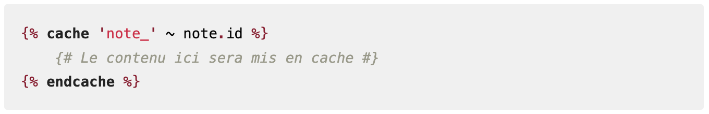

Les internautes "n'ont pas le temps", du coup c'est une obligation de leur donner le contenu qu'ils recherchent très rapidement. Lorsque nous développons une application, certaines étapes amèneront forcément de la compléxité.

Cette compléxité est un aspect important de l'expérience utilisateur. Car il peut impacter l'usage de nos ressources. Par exemple, si nous devons afficher la page de profil, nous avons pas moins de 4 requêtes SQL à faire :

- 1 pour récupérer les données de l'utilisateur
- 1 pour récupérer les notes de l'utilisateur
- 1 pour récupérer les notifications de l'utilisateur
- 1 pour récupérer les réseaux sociaux de l'utilisateur


Une solution pour réduire le nombre de requêtes SQL est de mettre en cache les données.

## C'est quoi un cache ?

Un peu d'histoire... Dans les années 1980, les ordinateurs étaient très lents. Dix secondes d'exécution pouvais devenir un enfer. Rappelons-nous que le développement d'applications web a pour destination des serveurs web, qui ne sont rien d'autre que des ordinateurs.

En 80, le web n'existe pas, alors cette question de performance concernait les ordinateur pour un usage professionnel "classique". Des innovations ont vu le jour avec l'évolution des processeurs, l'utilisation de la mémoire vive, l'avènement des cartes graphiques et des disques durs plus rapides, etc.

Ça a beaucoup évolué depuis. Maintenant un ordinateur se trouve dans votre poche, ou sur votre table au moment où vous lisez cette page.

Le cache, est une solution informatique qui permet de stocker des données en mémoire pour une utilisation ultérieure, pour un temps défini.

On peut lui appliquer des règles dans son accès, son expiration, son rafraîchissement, etc. Ce n'est pas de la persistence comme le ferait un SGBD.

## Dans Symfony, comment on fait ?

Il existe différente solutions pour implémenter le cache dans Symfony :

1. Utilisation du composant Cache de Symfony :

Le composant Cache de Symfony offre une interface unifiée pour travailler avec différents systèmes de cache. Voici un exemple d'utilisation :

```php
use Symfony\Contracts\Cache\ItemInterface;
use Symfony\Contracts\Cache\CacheInterface;

class NoteController extends AbstractController
{
    public function show(string $slug, NoteRepository $nr, CacheInterface $cache): Response
    {
        $note = $cache->get('note_'.$slug, function(ItemInterface $item) use ($nr, $slug) {
            $item->expiresAfter(3600); // Cache for 1 hour
            return $nr->findOneBySlug($slug);
        });

        // ...
    }
}
```

2. Utilisation du cache HTTP :

Symfony permet également de gérer le cache au niveau HTTP, ce qui peut être très efficace pour certains types de contenu :

```php
//...

use Symfony\Component\HttpKernel\Attribute\Cache;

class NoteController extends AbstractController
{
    #[Cache(public: true, maxage: 3600, smaxage: 7200)]
    public function index(): Response
    {
        // ...
    }

    //...
}

//...
```

3. Utilisation de Doctrine Query Cache :

Avec Doctrine ORM, vous pouvez mettre en cache les résultats de requêtes :

```php
$query = $entityManager->createQuery('SELECT n FROM App\Entity\Note n');
$query->setResultCacheDriver($cacheDriver);
$query->setResultCacheLifetime(3600);
$result = $query->getResult();
```

4. Utilisation de Twig Cache Extension :

Pour le cache au niveau des templates, vous pouvez utiliser l'extension Twig Cache :



Chacune de ces méthodes a ses avantages et ses cas d'utilisation spécifiques. Le choix dépendra de vos besoins précis en termes de performance, de granularité du cache et de la nature des données à mettre en cache.

## On met en cache les templates Twig

Dans notre cas nous allons mettre en cache les templates Twig. Il ne s'agit pas des templates complet mais des fragments de code qui contiennent beaucoup de données. C'est comme si nous permettons à Twig de ne pas avoir à récupérer l'ensemble des données fournies par le contrôleur.

Avant de commencer, il faut installer le package Twig Cache Extension :

```bash
composer require twig/cache-extra
```

Pour mettre en cache un template Twig, il suffit d'utiliser la directive `cache`.

---

Ressources :

- [Cache](https://symfony.com/doc/current/cache.html)
