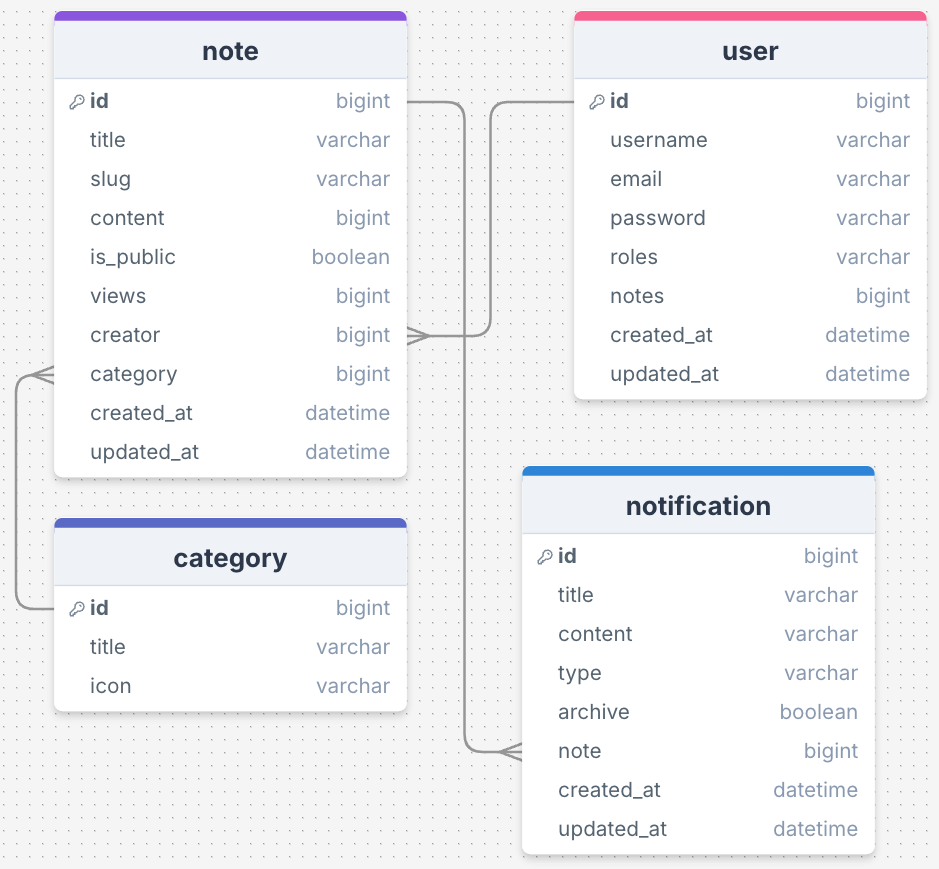

# Le projet CodeXpress

Avant d'écrire la moindre ligne de code, il est important de bien comprendre le projet que nous allons créer.

## Diagrammes de classes

##  Scénarios

Voici les scénarios de l'application :

| ------ | Rôle | ------ | Action | ------ | Résultat |
| --- | --- | --- | --- | --- | --- |
| **En tant** | qu'utilisateur | **je veux** | créer un compte | **afin** | de créer des notes |
| **En tant** | qu'utilisateur | **je veux** | me connecter | **afin** | d'accéder à mes notes |
| **En tant** | qu'utilisateur | **je veux** | me déconnecter | **afin** | de fermer ma connexion |
| **En tant** | qu'utilisateur | **je veux** | modifier un compte | **afin** | de la mettre à jour |
| **En tant** | qu'utilisateur | **je veux** | supprimer un compte | **afin** | de quitter l'application |
| **En tant** | qu'utilisateur | **je veux** | soumettre un formulaire | **afin** | de créer une note |
| **En tant** | qu'utilisateur | **je veux** | modifier une note | **afin** | de la mettre à jour |
| **En tant** | qu'utilisateur | **je veux** | modifier une note | **afin** | de la marquer comme publique ou privée |
| **En tant** | qu'utilisateur | **je veux** | annuler une note | **afin** | de la supprimer |
| **En tant** | qu'utilisateur | **je veux** | catégoriser une note | **afin** | de trier les notes |

---

Sans cela, il est difficile de comprendre le projet et de comprendre comment il fonctionne. Tous développeurs(euses) commencent par lire les diagrammes UML et les wireframes, mais cela ne suffit pas.

Il faudra aussi passer par la phase de rédaction d'algorithme basé sur les cas d'utilisation (UC) et les scénarios. Cela permet de comprendre comment les cas d'utilisation sont réalisés et comment les scénarios sont implémentés.

Pas de secret, nous ne sommes pas dans Matrix ou autre film du genre. Nous sommes dans un monde où les développeurs(euses) travaillent ensemble pour construire des applications web et des APIs. Cela se fait en parti par la communication et la collaboration. Il faut donc parler un langage commun et partager des connaissances.

---

## C'est quoi du coup ?

L'application est un gestionnaire de notes dédié au code. Il permet aux utilisateurs de créer, de modifier et de supprimer des notes. Les notes peuvent être catégorisées et peuvent être marquées comme publiques ou privées.

Publique, signifie que les notes sont visibles par tous les utilisateurs de l'application et en dehors. Privée, signifie que les notes sont visibles uniquement par les utilisateurs qui ont créées la note.

Rien de bien compliqué au premier coup d'oeil. Mais il faut bien comprendre que chaque étape de l'expérience utilisateur attendue.