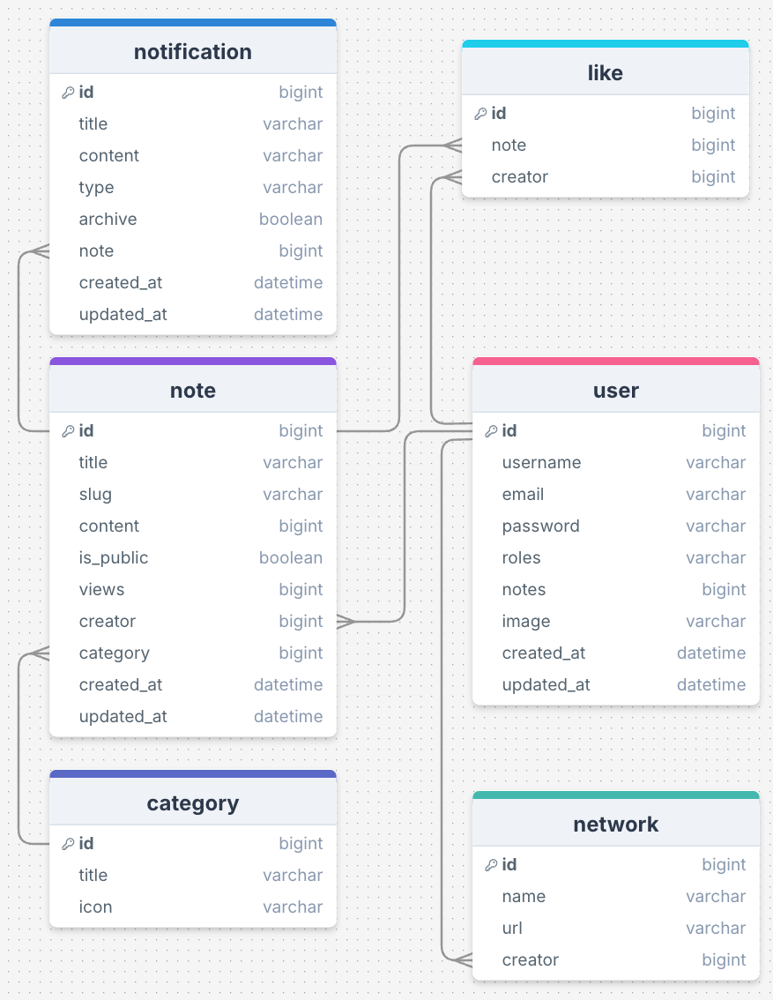

# Le projet CodeXpress

Avant d'écrire la moindre ligne de code, il est important de bien comprendre le projet que nous allons créer.

## Diagrammes de classes

##  Scénarios

Voici les scénarios de l'application :

| En tant | je veux | afin |
| --- | --- | --- |
| qu'utilisateur | créer un compte | de créer des notes |
| qu'utilisateur | me connecter | d'accéder à mes notes |
| qu'utilisateur | me déconnecter | de fermer ma connexion |
| qu'utilisateur | modifier un compte | de la mettre à jour |
| qu'utilisateur | supprimer un compte | de quitter l'application |
| qu'utilisateur | soumettre un formulaire | de créer une note |
| qu'utilisateur | modifier une note | de la mettre à jour |
| qu'utilisateur | modifier une note | de la marquer comme publique ou privée |
| qu'utilisateur | annuler une note | de la supprimer |
| qu'utilisateur | catégoriser une note | de trier les notes |
| qu'utilisateur | mettre un note en premium | de la monétiser |
| qu'utilisateur | consulter mes statiques | de les suivre |

---

Sans cela, il est difficile de comprendre le projet et de comprendre comment il fonctionne. Tous développeurs(euses) commencent par lire les diagrammes UML et les wireframes, mais cela ne suffit pas.

Il faudra aussi passer par la phase de rédaction d'algorithme basé sur les cas d'utilisation (UC) et les scénarios. Cela permet de comprendre comment les cas d'utilisation sont réalisés et comment les scénarios sont implémentés.

Pas de secret, nous ne sommes pas dans Matrix ou autre film du genre. Nous sommes dans un monde dans lequel les développeurs(euses) travaillent ensemble pour construire des applications web et des APIs. Cela se fait en parti par la communication et la collaboration. Il faut donc parler un langage commun et partager des connaissances.

---

## C'est quoi du coup ?

L'application est un gestionnaire de notes dédié au code. Il permet aux utilisateurs de créer, de modifier et de supprimer des notes. Les notes peuvent être catégorisées et peuvent être marquées comme publiques ou privées. Tous les utilisateurs peuvent "liker" les notes des autres au maximum une fois par note. Les utilisateurs diposent d'une page de profil publique avec leurs notes ainsi que des liens vers 3 réseaux sociaux maximum.

Publique, signifie que les notes sont visibles par tous les utilisateurs de l'application et en dehors. Privée, signifie que les notes sont visibles uniquement par les utilisateurs qui ont créées la note.

Un utilisateur peut souscrire à un abonnement premium qui lui donne accès à des fonctionnalités supplémentaires (monétisation, ia). Les abonnements sont gérés par le processeur de paiement Stripe.

Les utilisateurs peuvent également "monétiser" leurs notes. Le système de monétisation se base sur le nombre de vues uniques qu'une note a reçues. Une note est "monétisée" en fonction des conditions suivantes :

- Être un utilisateur premium
- 0,5ct euros par mille vues
- 1 vue par adresse IP unique
- Les vues comptabilisées doivent être issus des régions suivantes :
  - Europe (Tous les pays de l'union européenne)
  - Amérique du Nord (Canada, États-Unis)

Rien de bien compliqué au premier coup d'œil. Mais il faut bien comprendre que chaque étape de l'expérience utilisateur attendue.