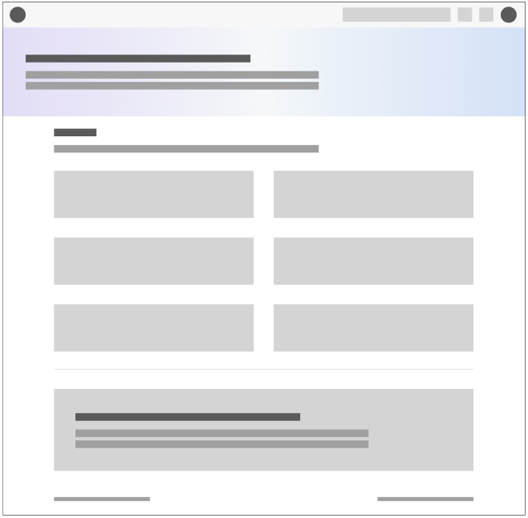

# Twig pour les templates

Twig est un moteur de template pour PHP. Il permet de créer des templates HTML dynamiques. Il est utilisé par Symfony pour générer les templates HTML. Lors de la création d'un nouveau projet Symfony, Twig est installé par défaut avec le drapeau `--webapp`.

## Les wireframes

Quelques wireframes pour mieux comprendre les templates Twig que nous allons créer :

**Home**

**Note**

****

---