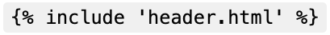

# Twig pour les templates

Twig est un moteur de template pour PHP. Il permet de créer des templates HTML dynamiques. Il est utilisé par Symfony pour générer les templates HTML. Lors de la création d'un nouveau projet Symfony, Twig est installé par défaut avec le drapeau `--webapp`.

## Les wireframes

Quelques wireframes pour mieux comprendre les templates Twig que nous allons créer :

**Home**

**Note**

---

## L'usage de Twig

Pour exploiter Twig au maximum, il est intéressant de connaitre l'ensemble de ses capacité en tant que langage de templating. Voici une liste non-exhaustive :

Voici une présentation des principales fonctionnalités et capacités de Twig en tant que moteur de templates :

### Syntaxe et structure

- **Délimiteurs** : Twig utilise `{{ }}` pour afficher des variables/expressions et `` pour les instructions de contrôle.

- **Commentaires** : Les commentaires sont encadrés par `{# #}`.

- **Héritage de templates** : Permet de créer des layouts réutilisables avec  et .

### Variables et expressions

- **Affichage de variables** : `{{ variable }}`
- **Filtres** : Modifient les variables, par exemple `{{ name|capitalize }}`
- **Tests** : Vérifient des conditions, comme 
- **Opérateurs** : Arithmétiques, logiques, de comparaison, etc.

### Structures de contrôle

- **Conditions** : 
- **Boucles** : 
- **Inclusion de templates** : 

### Fonctions et filtres

| Nom | Description |
|-----|-------------|
| attribute | Accède dynamiquement à un attribut d'une variable |
| block | Affiche un bloc défini dans le template |
| constant | Retourne la valeur d'une constante PHP |
| country_names | Retourne une liste de noms de pays |
| country_timezones | Retourne les fuseaux horaires d'un pays |
| currency_names | Retourne une liste de noms de devises |
| cycle | Alterne entre plusieurs valeurs |
| date | Formate une date |
| dump | Affiche des informations sur une variable (utile pour le débogage) |
| enum_cases | Retourne les cas d'une énumération PHP |
| html_classes | Génère une chaîne de classes HTML à partir d'un tableau |
| html_cva | Génère des attributs HTML à partir d'un tableau |
| include | Inclut un autre template |
| language_names | Retourne une liste de noms de langues |
| locale_names | Retourne une liste de noms de locales |
| max | Retourne la plus grande valeur d'un tableau ou d'une liste d'arguments |
| min | Retourne la plus petite valeur d'un tableau ou d'une liste d'arguments |
| parent | Affiche le contenu du bloc parent |
| random | Génère un nombre ou une chaîne aléatoire |
| range | Génère une séquence de nombres |
| script_names | Retourne une liste de noms de scripts d'écriture |
| source | Retourne le contenu d'un fichier |
| template_from_string | Crée un template à partir d'une chaîne |
| timezone_names | Retourne une liste de noms de fuseaux horaires |

### Sécurité

- **Échappement automatique** : Protection contre les attaques XSS
- **Mode sandbox** : Exécution sécurisée de code template non fiable

### Extensibilité

- Possibilité de créer des **extensions personnalisées**
- Ajout de nouvelles **fonctions**, **filtres** et **tags**

### Performance

- **Compilation des templates** en code PHP optimisé
- Mise en **cache** des templates compilés

En utilisant ces fonctionnalités, Twig permet de créer des templates puissants, flexibles et sécurisés, tout en gardant une syntaxe concise et lisible.
