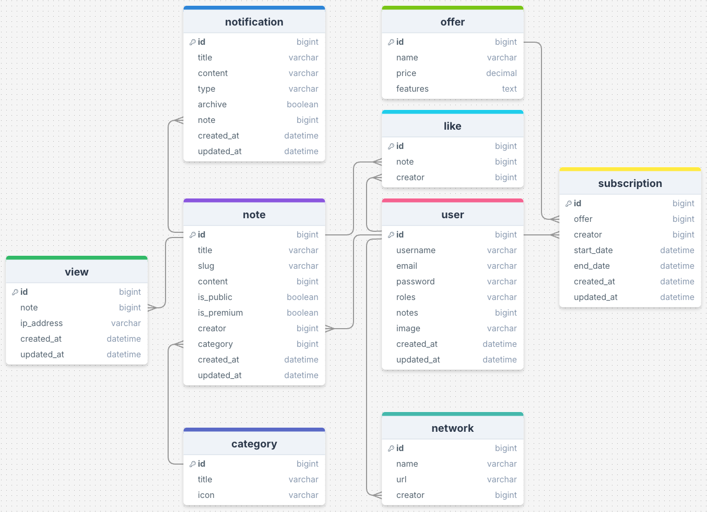

## TP2

Au cours de ce TP, vous allez devoir mettre à jour le projet CodeXpress.
D'abord, vous allez mettre à jour les templates Twig à partir du dépôt GitHub suivant :

[https://github.com/Jensone/codexpress-sf](https://github.com/Jensone/codexpress-sf)

### Entités

Les entités vont évoluer pour mieux répondre au projet, voici le nouveau schéma à mettre en place :

- La totalité des entités doivent être présentes dans le nouveau schéma.
- Vous devez mettre à jour la base de données avec une nouvelle migration.
- Vous devez mettre à jours les fixtures et remplir la base de données.

### Templates Twig

En vous basant sur les templates Twig déjà en place, vous allez devoir coder le template suivant :

- /note/new.html.twig
- /profile/edit.html.twig

**Rappel** : Un utilisateur peut créer une note publique ou privée et le formulaire doit automatique attribuer l'utilisateur acteul à la note.

---

Pour rendre votre travail, poussez votre code sur un dépôt GitHub.
Envoyez le lien à hello@agiliteach.org

### /!\ Pas d'envoi du travail avant 17h = TP 0/20. /!\